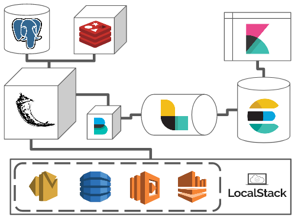

Building Apps with Flask, ELK, and Localstack
---

#### I. Overview

This repo contains a simple "Wikipedia Scraper" application. What it does is not necessarily
important as this code and framework could be applied to any business problem. The purpose is to 
showcase how the different components of the app can leverage AWS services via `localstack` such as:

- SQS (Simple Queue Service) for distributing messages
- SES (Simple Email Service) for emailing users
- DynamoDB for storing "scraper task" results
- Kinesis for real-time event processing
- Lambda for handling events

Moreover, the application utilizes various Flask "plugin" modules such as:

- `Flask-Caching` for interacting with Redis
- ~~`Flask-Compress` for faster template loads~~
- `Flask-Login` for user login management
- `Flask-Migrate` for data and schema migrations
- `Flask-SocketIO` for client/server polling
- `Flask-SQLAlchemy` as a database ORM

#### II. Todo:

- ~~Add Flask Migrate~~
- ~~Add socketio polling~~
- Add css and js "Bundles"
- Integrate with ELK stack
- ~~Add User "roles"~~
- Implement Caching with Redis
  - Session cache tokens
- Upgrade UI to Bootstrap v5.0
    - v5 form validation
    - ~~flash message alerts~~
- ~~Implement Kinesis streams~~
- Create Lambda to further process results
 